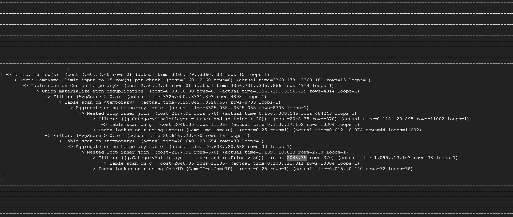
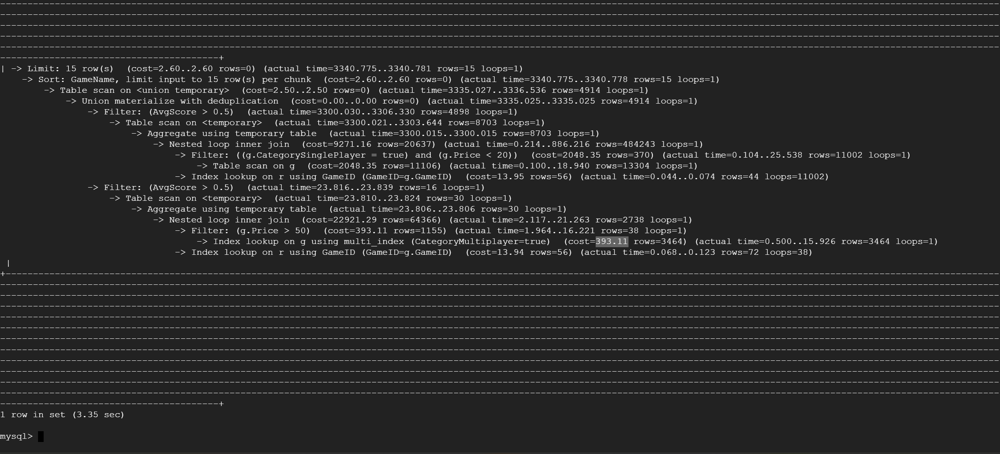
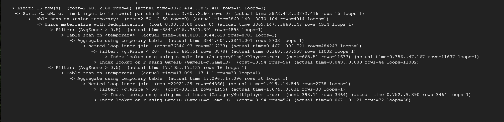
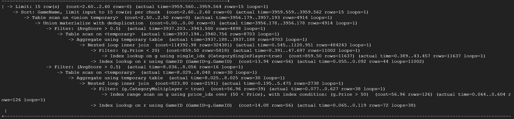

# Database Tables on GCP
 

# Insertions
 

# DDL Commands 

```sql 
CREATE TABLE Games(
  GameID INT PRIMARY KEY,
  GameName VARCHAR(255),
  ReleaseDate VARCHAR(255),
  MetacriticRating INT, 
  numReccomendations INT, 
  numOwners INT, 
  numPlayers INT, 
  PlatformWindows BOOL, 
  PlatformLinux BOOL, 
  PlatformMac BOOL, 
  CategorySinglePlayer BOOL, 
  CategoryMultiplayer BOOL, 
  CategoryCoop BOOL,
  CategoryMMO BOOL, 
  CategoryInAppPurchase BOOL, 
  CategoryIncludeSrcSDK BOOL, 
  CategoryIncludeLevelEditor BOOL, 
  CategoryVRSupport BOOL, 
  GenreIsNonGame BOOL,
  GenreIsIndie BOOL, 
  GenreIsAction BOOL, 
  GenreIsAdventure BOOL,
  GenreIsCasual BOOL, 
  GenreIsStrategy BOOL,
  GenreIsRPG BOOL, 
  GenreIsSimulation BOOL, 
  GenreIsEarlyAccess BOOL,
  GenreIsFreeToPlay BOOL, 
  GenreIsSports BOOL, 
  GenreIsRacing BOOL, 
  GenreIsMassivelyMultiplayer BOOL,
  Price FLOAT,
  AboutText TEXT(22512), 
  DescriptionText TEXT(22512)
);

CREATE TABLE User_Information(
  UserID VARCHAR(255) PRIMARY KEY,
  ComputerID INT, 
  Name VARCHAR(255),
  Password VARCHAR(255)
);

CREATE TABLE Computer_Information(
  ComputerID INT PRIMARY KEY REFERENCES User_Information(ComputerID) ON DELETE CASCADE,
  PlatformWindows BOOL, 
  PlatformLinux BOOL, 
  PlatformMac BOOL
);

CREATE TABLE Reviews(
  reviewID INT,
  GameID INT,
  GameName VARCHAR(255),
  reviewScore INT,
  reviewVotes INT,
  PRIMARY KEY (reviewID, gameID),
  FOREIGN KEY (gameID) REFERENCES Games(gameID) ON DELETE CASCADE
);

CREATE TABLE User_Recommended_Games(
  ReccID INT,
  GameID INT,
  UserID VARCHAR(255),
  GameName VARCHAR(255),
  UserRating INT,
  TimePlayed INT,
  PRIMARY KEY (ReccID, gameID, UserID),
  FOREIGN KEY (gameID) REFERENCES Games(gameID) ON DELETE CASCADE,
  FOREIGN KEY (UserID) REFERENCES User_Information(UserID) ON DELETE CASCADE
);

CREATE TABLE Friends(
  UserID VARCHAR(255) REFERENCES User_Information(UserID) ON DELETE CASCADE,
  FriendID VARCHAR(255),
  PRIMARY KEY(UserID, FriendID)
);

CREATE TABLE Meets_Specs(
  ComputerID INT REFERENCES Computer_Information(ComputerID) ON DELETE CASCADE,
  GameID INT REFERENCES Games(GameID) ON DELETE CASCADE,
  MeetsWindowsSpec BOOL,
  MeetsLinuxSpec BOOL,
  MeetsMacSpec BOOL,
  PRIMARY KEY (ComputerID, GameID)
);

CREATE TABLE Games_Owned(
  UserID VARCHAR(255) references User_Information(UserID) ON DELETE CASCADE,
  GameID INT REFERENCES Games(GameID) ON DELETE CASCADE,
  PRIMARY KEY(UserID, GameID)
);
```

# Advanced Queries 

## Query 1 

```sql
SELECT g.GameName, MetacriticRating , CAST(AVG(reviewScore) AS DECIMAL (10,2))AS AvgScore
FROM Games g JOIN Reviews r ON (g.GameId = r.GameId)
GROUP BY g.GameName, MetacriticRating
HAVING AvgScore > 0.5
ORDER BY g.GameName
LIMIT 15;
```
 

## Query 2 

```sql
(SELECT g.GameName, g.Price, CAST(AVG(reviewScore) AS DECIMAL (10,2))AS AvgScore
FROM Games g JOIN Reviews r ON (g.GameId = r.GameId)
WHERE  CategorySinglePlayer = 1 AND g.Price < 20.0
GROUP BY g.GameName, g.Price
HAVING AvgScore > 0.5)

UNION

(SELECT g.GameName, g.Price, CAST(AVG(reviewScore) AS DECIMAL (10,2))AS AvgScore
FROM Games g JOIN Reviews r ON (g.GameId = r.GameId)
WHERE  CategoryMultiPlayer = 1 AND  g.Price  > 50.0
GROUP BY g.GameName, g.Price
HAVING AvgScore > 0.5)
ORDER BY GameName
LIMIT 15;
```
 

# Index Analysis 

## Query 1:

Default Index: The costs are relativly high with the nested inner loop join having a cost of 207878, table scan having a cost of 2414, and index lookup having a cost of 12.56. These costs could mean that the query is using a lot of resources to get what is needed.
 

We added an index on gameName, but found no difference in the cost. We chose gameName because it was one of the attributes that didn't have a pointer to it. 
 

Index on metacritic rating also had no change on cost. We chose to index on metacritic as well since it was in out select cause without a pointer pointing to it, but it makes sense it had no impact on the cost since we are simply printing the critics.
 

reviewScore index no change in cost. We decided to index this because the aggregate function would be using this attribute to calculate a value for a specific game, yet it still did not change cost.
 

Overall, we did not find any significant change in cost even though we tried indexing 3 different attributes. We believe it is because we’re using an aggregate function and we are using the primary key to join tables which forces the compiler to go through a full table scan no matter what. Another possibility could be that the indexes weren't properly forming, however, we do not believe that is the case since a change was found on query #2. Due to this, we deicded to not use any indexing for this query as it did not change the cost associated with it.


## Query 2
Default Index: 
  

Creating index for categoryMultiplayer changed cost from 2048 to 393.11. 
 

Index for single player also decreased cost 665.51 from 2048.
 

The price index deceased the cost for nested loop inner join from 22k to 823.
 

