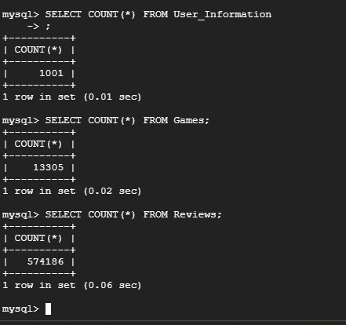

# Database Tables on GCP
 

# Insertions
 

# DDL Commands 

```sql 
CREATE TABLE Games(
  GameID INT PRIMARY KEY,
  GameName VARCHAR(255),
  ReleaseDate VARCHAR(255),
  MetacriticRating INT, 
  numReccomendations INT, 
  numOwners INT, 
  numPlayers INT, 
  PlatformWindows BOOL, 
  PlatformLinux BOOL, 
  PlatformMac BOOL, 
  CategorySinglePlayer BOOL, 
  CategoryMultiplayer BOOL, 
  CategoryCoop BOOL,
  CategoryMMO BOOL, 
  CategoryInAppPurchase BOOL, 
  CategoryIncludeSrcSDK BOOL, 
  CategoryIncludeLevelEditor BOOL, 
  CategoryVRSupport BOOL, 
  GenreIsNonGame BOOL,
  GenreIsIndie BOOL, 
  GenreIsAction BOOL, 
  GenreIsAdventure BOOL,
  GenreIsCasual BOOL, 
  GenreIsStrategy BOOL,
  GenreIsRPG BOOL, 
  GenreIsSimulation BOOL, 
  GenreIsEarlyAccess BOOL,
  GenreIsFreeToPlay BOOL, 
  GenreIsSports BOOL, 
  GenreIsRacing BOOL, 
  GenreIsMassivelyMultiplayer BOOL,
  Price FLOAT,
  AboutText TEXT(22512), 
  DescriptionText TEXT(22512)
);

CREATE TABLE User_Information(
  UserID VARCHAR(255) PRIMARY KEY,
  ComputerID INT, 
  Name VARCHAR(255),
  Password VARCHAR(255)
);

CREATE TABLE Computer_Information(
  ComputerID INT PRIMARY KEY REFERENCES User_Information(ComputerID) ON DELETE CASCADE,
  PlatformWindows BOOL, 
  PlatformLinux BOOL, 
  PlatformMac BOOL
);

CREATE TABLE Reviews(
  reviewID INT,
  GameID INT,
  GameName VARCHAR(255),
  reviewScore INT,
  reviewVotes INT,
  PRIMARY KEY (reviewID, gameID),
  FOREIGN KEY (gameID) REFERENCES Games(gameID) ON DELETE CASCADE
);

CREATE TABLE User_Recommended_Games(
  ReccID INT,
  GameID INT,
  UserID VARCHAR(255),
  GameName VARCHAR(255),
  UserRating INT,
  TimePlayed INT,
  PRIMARY KEY (ReccID, gameID, UserID),
  FOREIGN KEY (gameID) REFERENCES Games(gameID) ON DELETE CASCADE,
  FOREIGN KEY (UserID) REFERENCES User_Information(UserID) ON DELETE CASCADE
);

CREATE TABLE Friends(
  UserID VARCHAR(255) REFERENCES User_Information(UserID) ON DELETE CASCADE,
  FriendID VARCHAR(255),
  PRIMARY KEY(UserID, FriendID)
);

CREATE TABLE Meets_Specs(
  ComputerID INT REFERENCES Computer_Information(ComputerID) ON DELETE CASCADE,
  GameID INT REFERENCES Games(GameID) ON DELETE CASCADE,
  MeetsWindowsSpec BOOL,
  MeetsLinuxSpec BOOL,
  MeetsMacSpec BOOL,
  PRIMARY KEY (ComputerID, GameID)
);

CREATE TABLE Games_Owned(
  UserID VARCHAR(255) references User_Information(UserID) ON DELETE CASCADE,
  GameID INT REFERENCES Games(GameID) ON DELETE CASCADE,
  PRIMARY KEY(UserID, GameID)
);
```

# Advanced Queries 

## Query 1

## Query 2

# Index Analysis 

## Query 1

## Query 2
