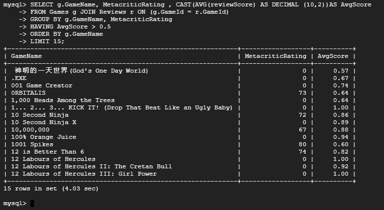
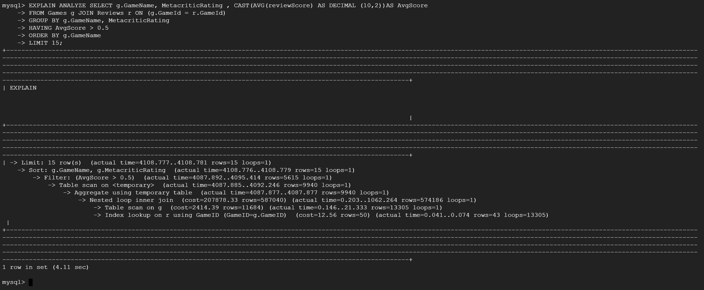
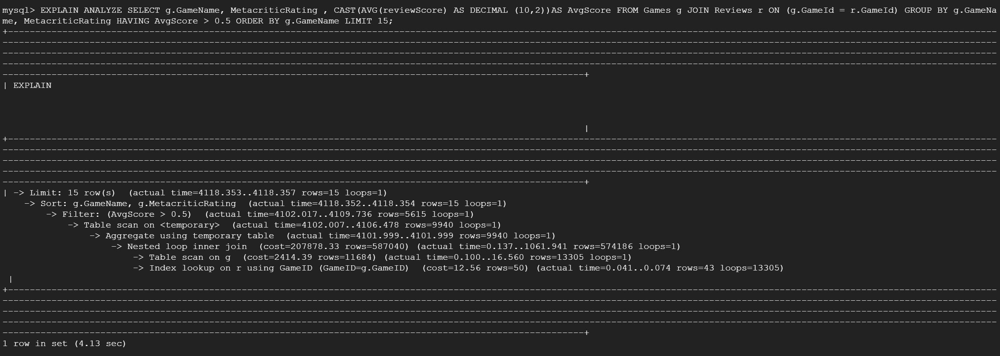
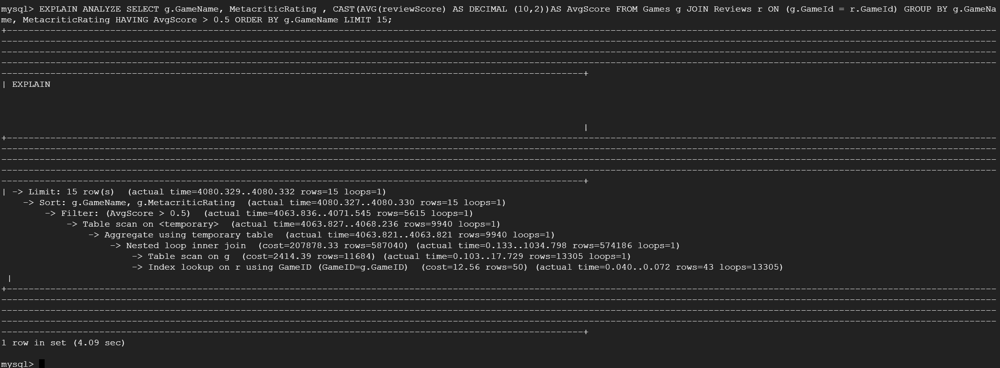
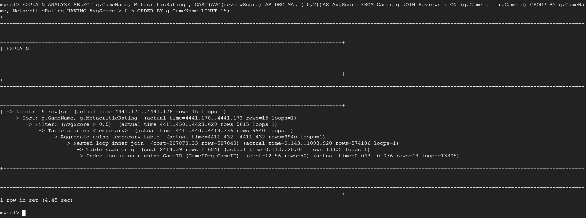

# Database Tables on GCP
 

# Insertions
 

# DDL Commands 

```sql 
CREATE TABLE Games(
  GameID INT PRIMARY KEY,
  GameName VARCHAR(255),
  ReleaseDate VARCHAR(255),
  MetacriticRating INT, 
  numReccomendations INT, 
  numOwners INT, 
  numPlayers INT, 
  PlatformWindows BOOL, 
  PlatformLinux BOOL, 
  PlatformMac BOOL, 
  CategorySinglePlayer BOOL, 
  CategoryMultiplayer BOOL, 
  CategoryCoop BOOL,
  CategoryMMO BOOL, 
  CategoryInAppPurchase BOOL, 
  CategoryIncludeSrcSDK BOOL, 
  CategoryIncludeLevelEditor BOOL, 
  CategoryVRSupport BOOL, 
  GenreIsNonGame BOOL,
  GenreIsIndie BOOL, 
  GenreIsAction BOOL, 
  GenreIsAdventure BOOL,
  GenreIsCasual BOOL, 
  GenreIsStrategy BOOL,
  GenreIsRPG BOOL, 
  GenreIsSimulation BOOL, 
  GenreIsEarlyAccess BOOL,
  GenreIsFreeToPlay BOOL, 
  GenreIsSports BOOL, 
  GenreIsRacing BOOL, 
  GenreIsMassivelyMultiplayer BOOL,
  Price FLOAT,
  AboutText TEXT(22512), 
  DescriptionText TEXT(22512)
);

CREATE TABLE User_Information(
  UserID VARCHAR(255) PRIMARY KEY,
  ComputerID INT, 
  Name VARCHAR(255),
  Password VARCHAR(255)
);

CREATE TABLE Computer_Information(
  ComputerID INT PRIMARY KEY REFERENCES User_Information(ComputerID) ON DELETE CASCADE,
  PlatformWindows BOOL, 
  PlatformLinux BOOL, 
  PlatformMac BOOL
);

CREATE TABLE Reviews(
  reviewID INT,
  GameID INT,
  GameName VARCHAR(255),
  reviewScore INT,
  reviewVotes INT,
  PRIMARY KEY (reviewID, gameID),
  FOREIGN KEY (gameID) REFERENCES Games(gameID) ON DELETE CASCADE
);

CREATE TABLE User_Recommended_Games(
  ReccID INT,
  GameID INT,
  UserID VARCHAR(255),
  GameName VARCHAR(255),
  UserRating INT,
  TimePlayed INT,
  PRIMARY KEY (ReccID, gameID, UserID),
  FOREIGN KEY (gameID) REFERENCES Games(gameID) ON DELETE CASCADE,
  FOREIGN KEY (UserID) REFERENCES User_Information(UserID) ON DELETE CASCADE
);

CREATE TABLE Friends(
  UserID VARCHAR(255) REFERENCES User_Information(UserID) ON DELETE CASCADE,
  FriendID VARCHAR(255),
  PRIMARY KEY(UserID, FriendID)
);

CREATE TABLE Meets_Specs(
  ComputerID INT REFERENCES Computer_Information(ComputerID) ON DELETE CASCADE,
  GameID INT REFERENCES Games(GameID) ON DELETE CASCADE,
  MeetsWindowsSpec BOOL,
  MeetsLinuxSpec BOOL,
  MeetsMacSpec BOOL,
  PRIMARY KEY (ComputerID, GameID)
);

CREATE TABLE Games_Owned(
  UserID VARCHAR(255) references User_Information(UserID) ON DELETE CASCADE,
  GameID INT REFERENCES Games(GameID) ON DELETE CASCADE,
  PRIMARY KEY(UserID, GameID)
);
```

# Advanced Queries 

## Query 1 
Write one SQL query to return the GameName and MetacriticRating of each Game
with average reviewScore above 90. Output the result in ascending order by GameName.


```sql
SELECT g.GameName, MetacriticRating , CAST(AVG(reviewScore) AS DECIMAL (10,2))AS AvgScore
FROM Games g JOIN Reviews r ON (g.GameId = r.GameId)
GROUP BY g.GameName, MetacriticRating
HAVING AvgScore > 0.5
ORDER BY g.GameName
LIMIT 15;
```
 

## Query 2 
Write a SQL query that returns the GameName, price, multiplayer support, and average reviewScore of 'SinglePlayer' games that have 'reviewScore’ of more than .5 and a price more than $10 and 'MultiPlayer' games that have 'reviewScore’ of more than .5 and price less than $10. Return the results in ascending order of GameName.


```sql
(SELECT g.GameName, g.Price, CAST(AVG(reviewScore) AS DECIMAL (10,2))AS AvgScore, CategorySinglePlayer, CategoryMultiPlayer
FROM Games g JOIN Reviews r ON (g.GameId = r.GameId)
WHERE  CategorySinglePlayer = 1 AND g.Price > 10.0
GROUP BY g.GameName, g.Price, CategorySinglePlayer, CategoryMultiPlayer
HAVING AvgScore > 0.5)

UNION

(SELECT g.GameName, g.Price, CAST(AVG(reviewScore) AS DECIMAL (10,2))AS AvgScore, CategorySinglePlayer, CategoryMultiPlayer
FROM Games g JOIN Reviews r ON (g.GameId = r.GameId)
WHERE  CategoryMultiPlayer = 1 AND  g.Price  < 10.0
GROUP BY g.GameName, g.Price, CategorySinglePlayer, CategoryMultiPlayer
HAVING AvgScore > 0.5)
ORDER BY GameName
LIMIT 15;
```

 

# Index Analysis 

## Query 1:

Default Index: The costs are relativly high with the nested inner loop join having a cost of 207878, table scan having a cost of 2414, and index lookup having a cost of 12.56. These costs could mean that the query is using a lot of resources to get what is needed.
 

We added an index on gameName, but found no difference in the cost. We chose gameName because it was one of the attributes that didn't have a pointer to it. 
 

Index on metacritic rating also had no change on cost. We chose to index on metacritic as well since it was in our select cause without a pointer pointing to it, but it makes sense it had no impact on the cost since we are simply printing the critics.
 

Index on reviewScore also had no change in cost. We decided to index this because the aggregate function would be using this attribute to calculate a value for a specific game, yet it still did not change cost.
 

Overall, we did not find any significant change in cost even though we tried indexing 3 different attributes. We believe it is because we’re using an aggregate function and we are using the primary key to join tables which forces the compiler to go through a full table scan no matter what. Another possibility could be that the indexes weren't properly forming, however, we do not believe that is the case since a change was found on query #2. Due to this, we deicded to not use any indexing for this query as it did not change the cost associated with it.


## Query 2
Default Index: This query has a lot more going on due to the fact we are using a set operation. The nested inner loop joins for both aspects of the query had a cost of 2177 and a filter cost of 2048. The cost for table scans were also 2048. 
  

Creating index for categoryMultiplayer changed the filter and index lookup cost from 2048 to 393.11 of the second block. However, this also had a consequence of increasing the cost of both nested inner loop joins to above 9000, much higher than the original 2177. 
 

Index for single player also decreased cost 665.51 from 2048 in the first block, however, the inner join costs keep rising even higher. 
 

The price index deceased the cost for nested loop inner join from 22k to 823 as well as the filter cost of the second block down to 53. However, the nested loop inner join in the first block has now skyrocketed to above 100,000.
 

Overall, we did find significant differences when we started indexing certain attributes. There was a general trend of where we index a certain attribute, the filter and index look up costs kept decreasing while the nested loop inner joins kept increasing. This leads to a dilemma as to what to pick for indexing. There is both a benefit and detriment to choosing these indices. We believe the inner join for the first block kept skyrocketing due to the fact that we are using a set operation and it is causing some increased overhead. We think that since a price index drastically changed the cost for the second inner join cost, that it would be optimal to use that going forward. 
