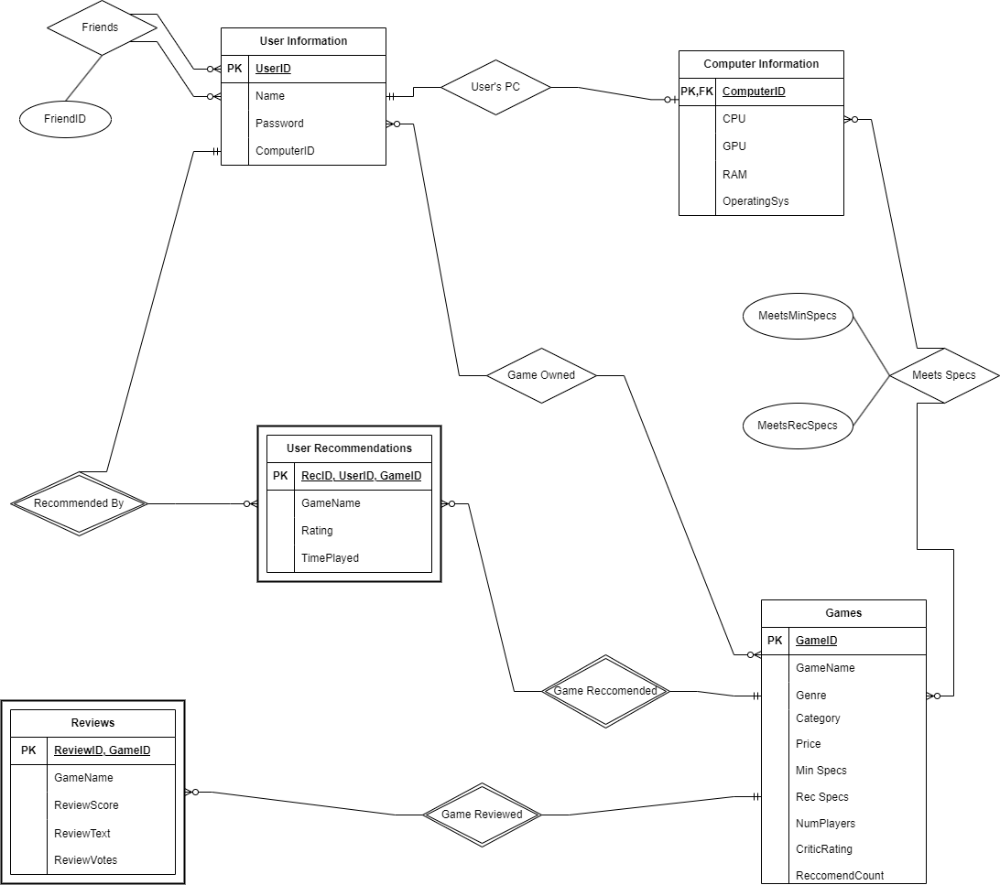

## Diagram:
 

## Assumptions & Relationships:

The User Information entity contains information about users for our website such as a unqiue UserID, Name, Password & ComputerID. 
The User Information table has a relationship on itself called Friends which will be used to keep track of users adding each other as friends on our website so that we can tailor game reccomendations based on what a user's friends are playing. This relationship is optional Many to Many as each user can be friends with Zero to many users. 

The Computer Information entity contains information about users computers which they add when using our website, this entity will help with ensure compatibilty between as user's computer and the games we reccomend to them. The relationship between User Information & Computer Information is One to One as we assume that a user will have at most one computer and a computer can only belong to one user.

The Games entity contains the information from the Steam Games dataset, each game has a unqiue GameID and a list of attributes that will come from the dataset. The Relationship between User Information & Games is optional Many to Many as a user can own multiple games and a game can be owned by multiple users. 

The Relationship between Computer Information & Games is also optional Many to Many, as a computer can be compatible with multiple games and a game can be compatible with multiple computers. Addtionally, two attributes are added to this relationship, they are called "MeetsMinSpecs" and "MeetsRecSpecs". These attributes serve to signfiy whether a computer meets just the minimum requirements to run a game or if it meets both the minimum & reccomeneded requriements to run a certain game. 

The Reviews entity contains information from the Steam Reviews dataset, it is a weak entity that relies on the Games table to define it as a GameID is needed to know which game is being reviewed. The relationship between the Games entity and Reviews entity is optional Many to One, as a Game can have many reviews but a review can only be for one game. 

The User Reccomendations entity represents the Games that users of our website reccomend, this is seperate from the Steam Reviews entity as the User Reccomendations entity will be used for providing game reccomendations based on friends. This entity is also a weak entity as it relies on the Games and User Information table to know which user reccomends which game. The relationship between Users & User Recomendations is optional Many to One, as a user can make many reccomendations but a reccomendation is only linked to one user. Similarly, the relationship between Games & User Reccomnedations is Many to One as a Game can have many reccomendations, but a reccomendation can only be about one game. 


## Relational Schema/Logical Design: 

```sql
Games(
    gameID: INT [PK],
    gameName: varchar(255),
    genre: varchar(255),
    category: varchar(255),
    price: INT,
    minSpecs: varchar(255),
    recSpecs: varchar(255),
    numPlayers: INT,
    metaCriticRating: INT,
    numReccomendations: INT;
  );

Reviews(
    reviewID: INT [PK],
    gameID: INT [PK],
    GameName: varchar(255),
    reviewScore: INT,
    reviewText: varchar(255),
    reviewVotes: INT
  );

User_Recommended_Games(
  LikedID: varchar(255) [PK],
  GameID: varchar(255) [PK],
  UserID: varchar(255) [PK],
  GameName: varchar(255),
  UserRating: INT,
  TimePlayed: INT;
);

User_Information(
  UserID: INT [PK],
  Name: VARCHAR(255),
  Password: VARCHAR(255),
  ComputerId: VARCHAR(255)
);

Computer_Information(
  ComputerID: VARCHAR(255) [PK],
  CPU: VARCHAR(255),
  GPU: VARCHAR(255),
  RAM: VARCHAR(10),
  Operating_sys: VARCHAR(255)
);

User_PC(
  UserID: INT [PK],
  ComputerID: VARCHAR(255) [PK]
);

Friends(
  UserID: INT [PK]
  FriendID: INT
);

Games_Owned(
  UserID: INT [PK],
  GameID: INT [PK] 
);

Meets_Specs(
  ComputerID: INT [PK],
  GameID: INT [PK],
  MeetsMinSpec: BOOL,
  MeetsRecSpec: BOOL 
);

```
